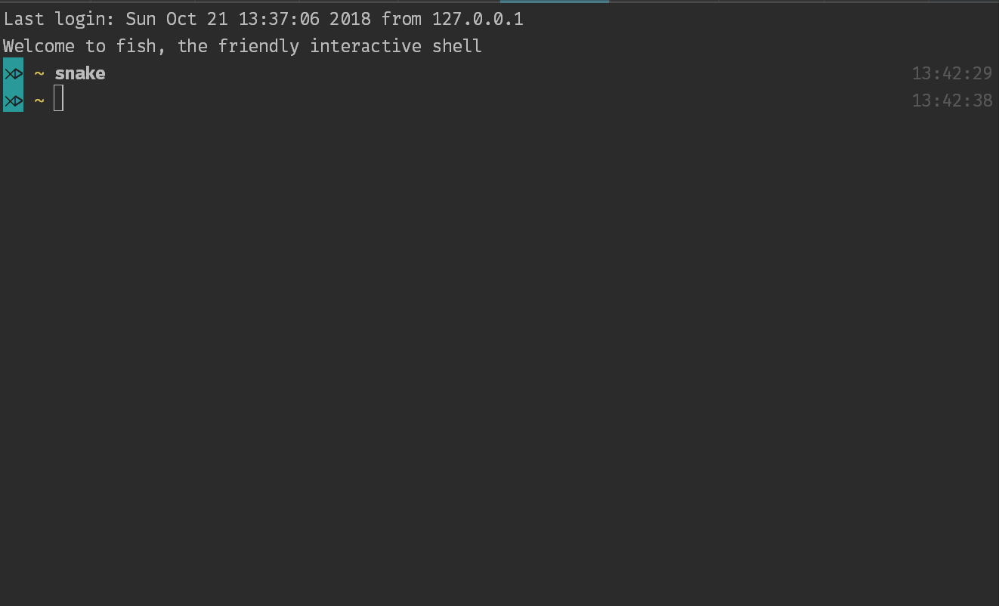

# Snake Game

## screenshot



## install

prerequest

1. ubuntu 18.04
2. python 3.6
3. pip3
4. pipenv

```bash
git clone https://github.com/zjl233/snake_game.git
cd snake_game
pipenv install
pipenv shell
pyinstaller src/main.py -n snake -F
cp dist/snake /usr/bin/
```

# run

```bash
snake
```

# uninstall

```bash
rm /usr/bin/snake
```

